EXECUTIVE SUMMARY

Emily, a 30-year-old Data analyst, seeks GSM Bank’s financial advice to
plan her superannuation funds for retirement. Currently earning NZD
80,000 with an average annual raise of 3.5%, she currently benefits from
an employer-matched contribution of 3% to her superannuation. Her
current investments span into three funds: Stable, Balanced, and
SkyHigh. This report offers tailored strategies to optimize risk
management that would give her financial stability at retirement.

The investment suggestions for Emily are:

> ● Gradually increase the percentage of superannuation fund
> contributions to a maximum of 10% over the years.
>
> ● Adjust the investment allocation across the three funds as the
> contribution percentage rises.
>
> ● Ensure that, by retirement age, most of the investment is allocated
> to both a stable bond fund and a balanced hybrid fund.

The recommendation considers the average life expectancy of women in New
Zealand along with parameters like inflation, the cost of living and
future expenses until and after her retirement. The projected investment
returns are designed to sustain Emily's current lifestyle, travel
regularly, leisure activities, and will have sufficient funds for
healthcare and unforeseen expenses after retirement.

INTRODUCTION

Retirement planning is essential for ensuring a financially secure and
comfortable future, particularly for individuals likeEmily, who
areplanning an eventful post-retirement life. Emily, a 30-year-old data
analyst based in New Zealand, working from the age of 24 and plans to
retire at the age of 65. Considering the average life expectancy of
women in New Zealand, the post-retirement cost of living has been
calculated to ensure the optimal fund allocation, providing financial
stability. She envisions her retirement life to match her current
standard of living, travelling regularly and engaging in leisure
activities while having sufficient funds to cover healthcare and
unforeseen expenses.

With a minimum superannuation contribution scheme, it would be hard to
plan a post-retirement life as inflation can significantly impact her
future living cost. Her current superannuation contributions matched
with her employers contribution, are invested across stable, balanced,
and growth-oriented funds. While this diversified approach provides
stability, its ability to meet her long-term financial need accounting
for rising costs, salary growth, and market performance requires further
analysis.

This report evaluates Emily’s current superannuation strategy and
projects the future value of her retirement savings based on her salary
progression, expected contributions, fund performance, and inflation. It
also estimates her post-retirement expenses and compares them with her
projected retirement corpus. Based on these findings, we will provide a
tailored superannuation strategy aligned with her goals and risk
tolerance, ensuring a secure and fulfilling retirement.

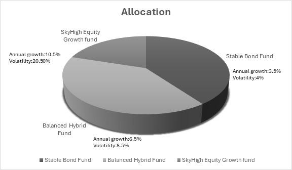

SUPERANNUATION STRATEGY REVIEW

<u>Evaluation of Current Superannuation Investment Allocation</u>

The current allocation strategy of the superannuation fund divides her
contribution into three funds: 40% in Stable bonds fund, 40% into
Balanced fund and 20% into SkyHigh.

||
||
||
||
||
||

> Table 1: Invested Funds
>
> Fig 1: Current Fund Allocation

The low growth rate of the stable fund may not align with Emily’s
long-term need for higher returns to meet her retirement goals. While a
slightly higher allocation to SkyHigh could enhance her returns while
maintaining acceptable risk, the balanced fund aligns well with her
short-term goals.

<u>Assessment of Contribution</u>

Currently, she contributes 3% of the salary, matched by her employer.
This results in an annual contribution of NZD 4601.43. Assuming an
average salary growth of 3.5% with 0.7 as standard deviation, and her
contributions scale proportionately:

> ● The current contributions may not suffice to achieve her retirement
> lifestyle envisioned since other factors like inflation, increase in
> taxes, healthcare cost can affect the spending and saving rates.
>
> ● To match her goals, increasing the contribution from the 3%
> threshold is advisable, since the employer would also match her
> contribution up to 10%.

Based on the volatility of each fund, we can calculate the risk score
for Emily's investment portfolio. The calculation is attached in the
appendix (refer Appendix A.1) for the same:

> ● Stable Bonds Fund has a volatility of 4%, so the weight for risk
> score is 1.
>
> ● Balanced Hybrid Fund has a volatility of 8.5%, so the weight for
> risk score is 2.12.
>
> ● SkyHigh Equity Growth Fund has a volatility of 20.5%, so the weight
> for risk score is 5.12.

Using these figures, we calculate the overall portfolio risk score:

> ● The current Risk Score for Emily’s superannuation investments is 44.
>
> ● This risk score of 44 places Emily’s portfolio in the medium to
> high-risk category, reflecting a significant exposure to market
> volatility, especially due to the 20% steady allocation in the
> high-risk SkyHigh Fund.

To maintain her current lifestyle, including travel and leisure
activities, Emily will need an average of NZD 130,000 per year
post-retirement life. To reach this goal, she should gradually increase
her superannuation contributions in a way that balances growth and
stability. This will help her build a solid retirement fund while
minimizing risks over time.

<u>Recommendations for Adjustments</u>

Emily is currently contributing 3% of her salary to her superannuation
fund. Based on this contribution and her current investment choices, we
estimate that her superannuation balance when she reaches 65 will likely
fall between \$1.21 million and \$1.29 million, considering the past
performance of her chosen funds.

However, this amount will not be enough to support Emily’s desired
retirement lifestyle, which includes maintaining her current standard of
living and her travel and leisure activities. As per our calculation,
she should have an average of NZD 130000 per year post-retirement, which
means she needs to increase her current contribution and investment
strategy.

> 1\. **Reallocation** **of** **Equity:**Adjust allocation in Stable,
> Balanced, and SkyHigh to balance risk and maximize growth ,
> optimization technique was used to obtain maximum return with respect
> to risk constraints (referAppendix A.2).
>
> 2\. **Increase** **Contributions:** Raise contributions from 3-10% of
> her salary to build a larger retirement corpus.
>
> 3\. **Rebalance** **Periodically:** Review the portfolio every 5 years
> to adjust risk as retirement approaches.

||
||
||
||
||
||
||
||

> 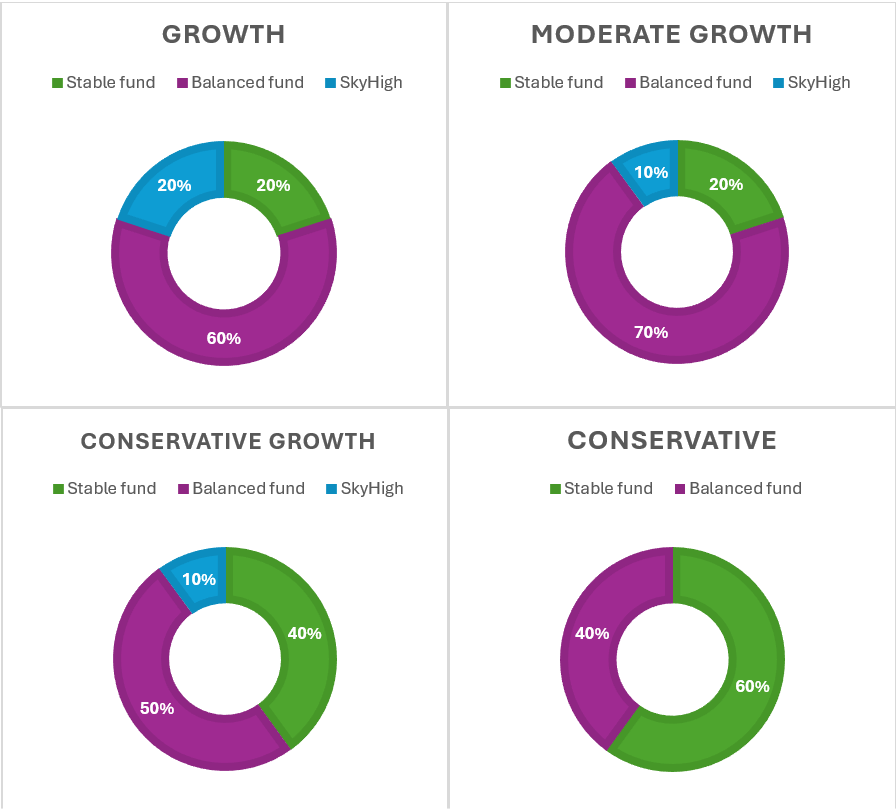 style="width:6.55569in;height:5.91875in" />Table 2: Proposed Slab wise
> Fund Allocation and Risk score Allocation
>
> Fig 2: Proposed Fund Allocation

PROJECTION METHODOLOGY

To project the future value of Emily's superannuation fund, considering
the variability in salary increases and fund performance, we use a Monte
Carlo simulation approach. This method captures the impact of
uncertainties and generates a range of potential outcomes.

**Salary** **Growth**: Grows annually based on a random normal
distribution with a mean growth rate of 3.5% (±0.7%).

**Contributions**: Emily contributes 3% of her gross salary, with a
matching contribution from her employer (up to 3%) and annual government
contributions of NZD 521.43.

**Investment** **Allocation:** The annual growth of each fund is
modelled using random sampling from their respective distributions,
reflecting market uncertainty.

**Fund** **Balances:** The balance of each fund grows based on its rate
of return, and contributions are added proportionally.

**Inflation**: According to the statistics, the NZ inflation rate is
between 2-3% and now it is at 2.2%. All the future expenses were
calculated using the inflation, since the expenses are bound to increase
with the change.

**Monte** **Carlo** **Approach:** Multiple simulations were performed to
estimate the range of possible outcomes for Superannuation fund by
calculating the expected value of fund at retirement and confidence
interval, providing a range for the likely final balance.

To achieve Emily’s financial goals, we recommend a **slab-wise**
**increase** **in** **superannuation** **contributions** and adjustments
to her fund allocation.

> 1\. **Contribution** **Increase** **Strategy:**
>
> o Gradual contribution increases from 3% to 10% over the next 25
> years, incrementing by **1-2%** **every** **5** **years**.
>
> o With employer matching, contributions effectively double, enhancing
> savings while ensuring returns, significantly.
>
> o Utilizes approximately **22%** **of** **unused** **salary**
> **balance**, while reducing taxable income.
>
> 2\. **Portfolio** **Reallocation** **for** **Stability:** Fund
> allocation adjustments as contributions increase:
>
> ● Slab 1 (4% Contribution): Stable (20%), Balanced (60%), SkyHigh
> (20%) — Risk Score: **49** **(medium-high** **risk)**.
>
> ● Slab 2 (6% Contribution): Stable (20%), Balanced (70%), SkyHigh
> (10%) — Risk Score: **43** **(medium** **risk)**.
>
> ● Slab 3 (8% Contribution): Stable (40%), Balanced (50%), SkyHigh
> (10%) — Risk Score: **38** **(low-medium** **risk)**.

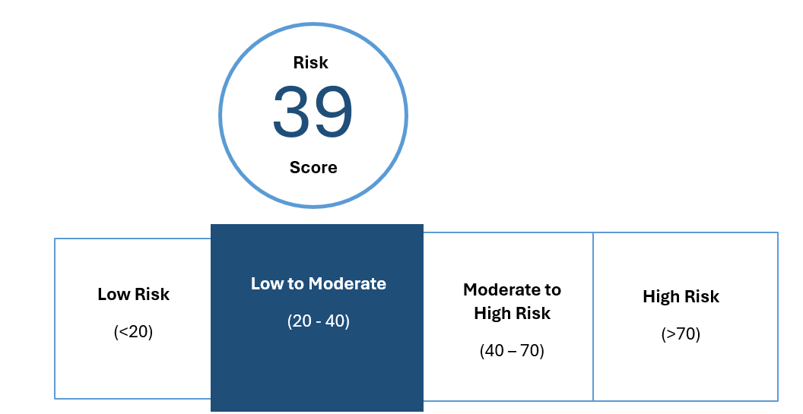

> ● Slab 4 (10% Contribution): Stable (60%), Balanced (40%), SkyHigh
> (0%) — Risk Score: **28** **(low** **risk)**.

Overall Risk Score became **39** **(Medium-low)**

> Fig 3: Risk score of proposed investment strategy

Increased superannuation contributions can lead to tax savings,
enhancing the net retirement savings.

> 3\. **Projected** **Outcome:**
>
> o By aligning contributions and allocations with her salary growth and
> risk tolerance, Emily’s superannuation fund can grow to **NZD**
> **2.35** **Million** (refer Appendix C.3) **by** **retirement**.
>
> o This corpus will adequately cover her retirement goals, factoring in
> inflation (2–3%) and life expectancy projections.
>
> o She can withdraw the required amount annually for her
> post-retirement life expenses, thereby continuously getting returns of
> the balance amount.
>
> o Based on our analysis, Emily will need approximately NZD 98,000
> annually at the beginning of her retirement, with expenses expected to
> rise in line with inflation. Considering projected investment returns,
> she can withdraw up to a maximum of NZD 180,000 per year (refer
> Appendix C.4), with the surplus serving as a contingency fund for
> unforeseen circumstances.

ANALYSIS FRAMEWORK

<u>Data Collection</u>

> ● **Demographic** **Details:**
>
> ○ Collected information on the data analyst’s age (30 years),
> profession, and income (NZD 80,000). The expected salary growth-rate
> is 3.5% (±0.7%).
>
> ● **Lifestyle** **and** **Economic** **Factors:**
>
> ○ Examined annual inflation rates (2–3%) to estimate future
> cost-of-living adjustments.
>
> ○ Researched the average life expectancy of women is 90 years, (refer
> Appendix B.3) and potential future shifts due to advancements in
> healthcare.
>
> ● **Superannuation** **Scheme** **Details:**
>
> ○ Evaluated the current employer-matched contribution plan and
> employee allocation (Stable Bonds, Balanced Hybrid, and SkyHigh Growth
> funds).
>
> ● **Financial** **Patterns:**
>
> ○ Assessed the starting age of employment and financial patterns,
> including expected expenses, savings trends, and superannuation
> balances.

<u>Model Simulation</u>

Using a Monte Carlo model, we analysed Emily's superannuation growth by
age 65, assessing best- and worst-case scenarios. The analysis revealed
she could withdraw up to NZD 180,000 annually, exceeding her estimated
need of NZD 130,000, with the surplus serving as a risk fund for
unforeseen expenses.

With the average life expectancy for women in New Zealand in mind, we
suggested a few changes to her investment strategy. The plan is to
gradually increase her superannuation contributions every five years,
eventually reaching 10%. Plus, she’ll benefit from her employer matching
those contributions along the way. These adjustments are designed to
give Emily confidence and flexibility in her financial future, making
sure she can enjoy the lifestyle she’s planning for in retirement.

We also took inflation into account, estimating a 2-3% increase in
expenses each year. Since Emily doesn't desire a luxurious lifestyle and
simply wants to maintain her current standard of living with the
addition of travel and leisure activities, it is recommended that she
focus her investments on stable and balanced funds. This approach will
provide her with the necessary stability and growth to achieve her goals
while managing risk effectively.

An optimization model was created with a minimum allocation of 20% in
the Stable bonds fund and at most 20% in skyhigh equity growth fund.
Since the funds were allocated to minimize risk, the allocation to the
SkyHigh fund was kept lower. This approach ensures that even in
unforeseen circumstances, Emily will have sufficient savings by the time
she nears

retirement. By the time Emily retires, the remaining balance after
covering her expenses will be nearly 40% of her salary, providing a
solid financial stability to handle any unexpected emergencies that may
arise in her life. She can also rely on these savings to cover
unexpected expenses while keeping her lifestyle modest. Meanwhile, the
superannuation funds can continue to generate returns, enabling her to
maintain a comfortable and sustainable lifestyle post-retirement.

CONCLUSION

Emily is well-positioned for a financially secure and fulfilling
retirement. Her solid salary and the combined superannuation
contributions from both her and her employer provide a strong
foundation. To fully realize her dream retirement—travelling, enjoying
leisure activities, and maintaining a safety net for unforeseen
circumstances—Emily could make some strategic adjustments to her
superannuation.

Currently, her fund allocation leans more conservatively than necessary
for someone of her age and financial standing. Shifting her
contributions tomoderate-risk funds would allow forhigher potential
returns without exposing her to excessive risk. From our simulations,
this approach would enable Emily to save nearly 40% more by the time she
approaches retirement. This cushion ensures she can sustain herself
comfortably through any unforeseen challenges, including emergencies.

Increasing her superannuation contribution rate is another impactful
step Emily can take. By gradually raising her contributions to 10% over
the next 20 years, she can maximize the power of compounding interest.
This strategy significantly enhances her financial stability, paving the
way for a more comfortable retirement.

Regularly reviewing her superannuation strategy is equally essential. By
periodically evaluating her investments, Emily can adjust her portfolio
to include more stable and balanced funds as she nears retirement. This
shift helps protect her accumulated savings while still allowing for
growth. Additionally, using Monte Carlo simulations to model various
scenarios will prepare her for market fluctuations and ensure she
remains on track.

With these focused adjustments—reallocating funds to moderate risk,
increasing contributions, and staying proactive in her reviews—Emily is
set to achieve her retirement dreams.

REFERENCES

Business Insider. (n.d.). *The* *average* *mortgage* *payment* *is*
*\$2,317* *per* *month*. Retrieved November 28, 2024, from
[https://www.businessinsider.com/personal-finance/mortgages/average-mortgage-payment#:~:text=The%20average%20mortgage%20payment%20is,to%20the%20Mortgage](https://www.businessinsider.com/personal-finance/mortgages/average-mortgage-payment#:~:text=The%20average%20mortgage%20payment%20is,to%20the%20Mortgage%20Bankers%20Association)
[%20Bankers%20Association](https://www.businessinsider.com/personal-finance/mortgages/average-mortgage-payment#:~:text=The%20average%20mortgage%20payment%20is,to%20the%20Mortgage%20Bankers%20Association)

Hirschfeld, M., & Andrews, H. (n.d.). *Intergenerational* *impacts:*
*The* *sustainability* *of* *New* *Zealand* *superannuation*.

Inland Revenue Department. (n.d.). *Joining* *KiwiSaver* *as* *an*
*employee*. Retrieved November 28, 2024, from
[<u>https://www.ird.govt.nz/kiwisaver/kiwisaver-individuals/joining-kiwisaver/joining-kiwisaver-as-an-employee</u>](https://www.ird.govt.nz/kiwisaver/kiwisaver-individuals/joining-kiwisaver/joining-kiwisaver-as-an-employee)

OpenAI. (2024). ChatGPT (November 2024 version) \[Large language
model\].
[<u>https://www.openai.com/chatgpt</u>](https://www.openai.com/chatgpt)

Peri, K., & Kerse, N. (2018). *Health* *profile* *of* *residents* *of*
*retirement* *villages* *in* *Auckland,* *New* *Zealand:* *Findings*
*from* *a* *cross-sectional* *survey* *with* *health* *assessment*.
*Australasian* *Journal* *on* *Ageing,* *37*(4), 293–300.
https://doi.org/10.1111/ajag.12628

Reserve Bank of New Zealand. (n.d.). *Inflation:* *What* *it* *is* *and*
*how* *we* *measure* *it*. Retrieved November 28, 2024, from
https://www.rbnz.govt.nz/monetary-policy/about-monetary-policy/inflation

Stats NZ. (2022, April 21). *Annual* *inflation* *reaches* *30-year*
*high* *of* *6.9* *percent*. Retrieved from
https://www.stats.govt.nz/news/annual-inflation-reaches-30-year-high-of-6-9-percent

Stats NZ. (n.d.). *How* *long* *will* *I* *live?* Retrieved November 28,
2024, from https://www.stats.govt.nz/tools/how-long-will-i-live/

APPENDIX **APPENDIX** **A**

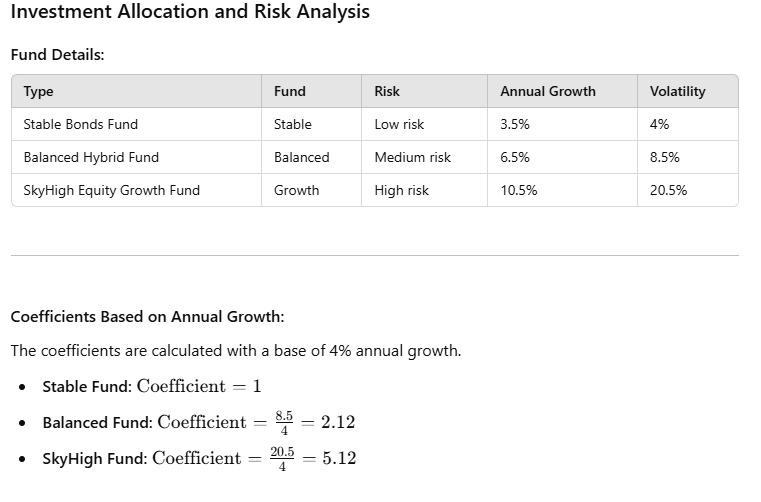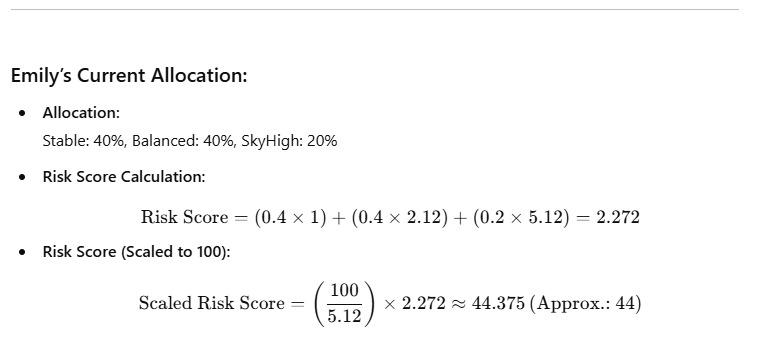A.1:Riskscorecalculation

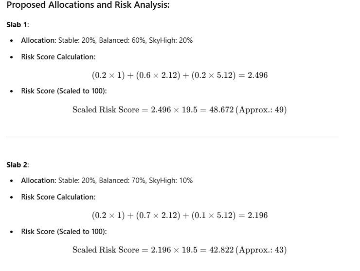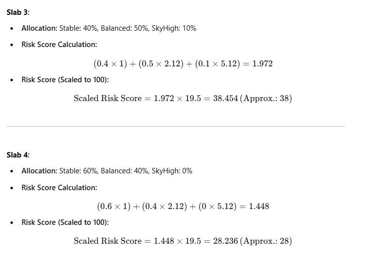

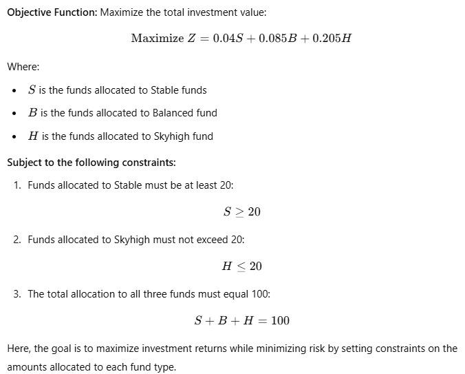

A.2:FormulationforoptimizationoffundAllocation

**APPENDIX** **B**

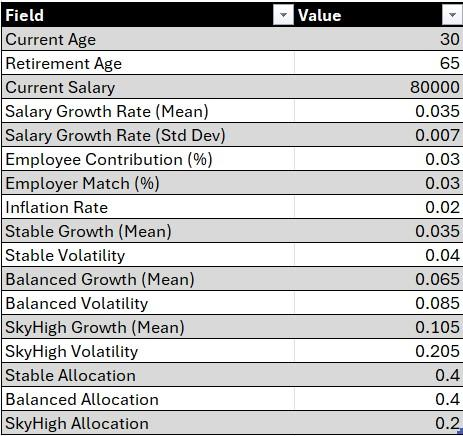B.1:ModelParametersforCurrentStrategy

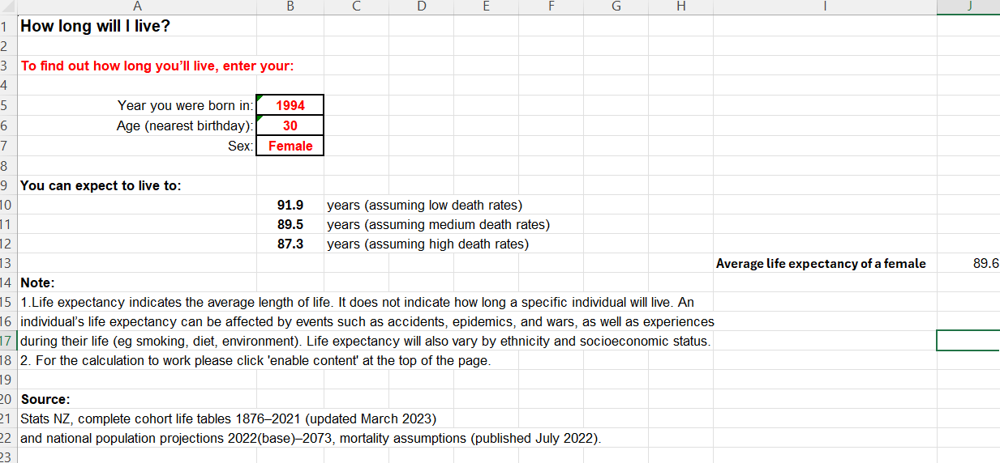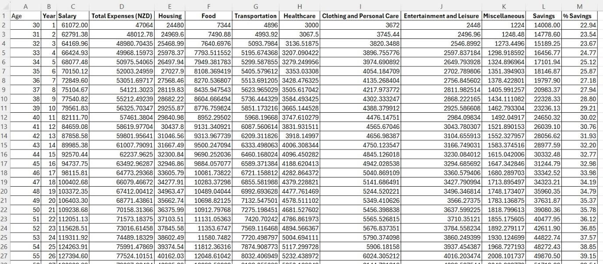

B.2:Emily’sFutureExpenses

B.3:LifeExpectancyCalculation

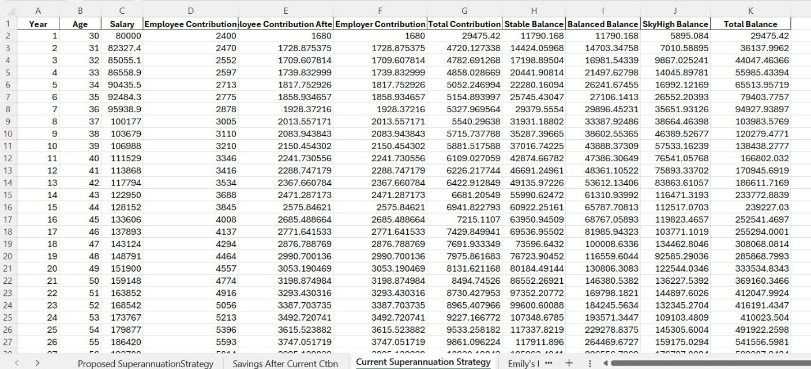B.4:CurrentSuperannuationStrategy

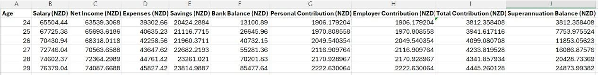

B.5:MonteCarlo Results(Statistics) for currentstrategy

B.6:Annual Withdrawalbasedoncurrentstrategy

> 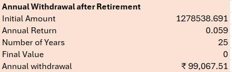 style="width:3.89167in;height:1.20833in" />NZD

B.7: Pastsuperannuationbalance

**APPENDIX** **C:**Model ParametersforModellingProposedAssessment

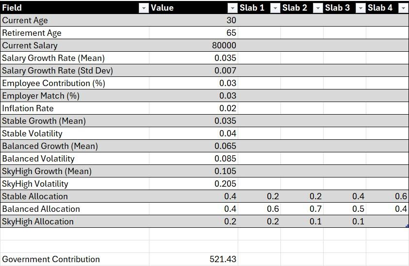C.1:Model Parametersfor
ProposedStrategy

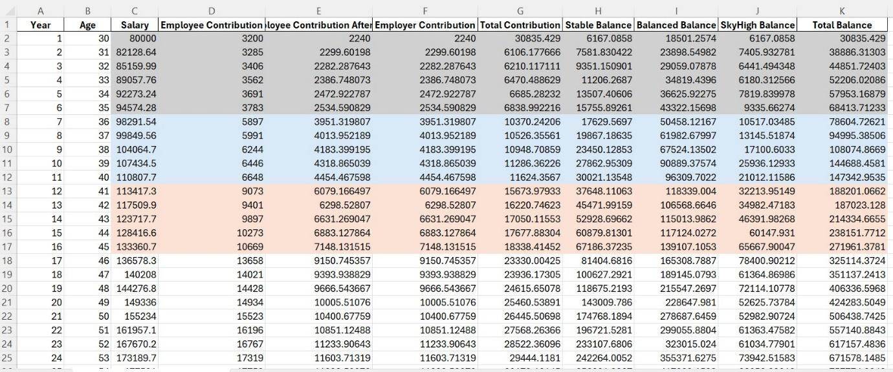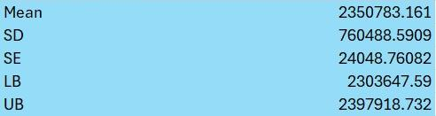

C2:ProposedSuperannuationStrategy

C.3:MonteCarloResults(Statistics) for theproposedstrategy

C.4:AnnualWithdrawal basedontheproposedstrategy

> 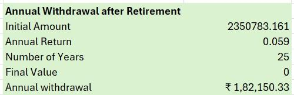 style="width:4.475in;height:1.44986in" />NZD

**APPENDIX** **D:**Summary of the Use of GenerativeAI tools

||
||
||
||
||
||

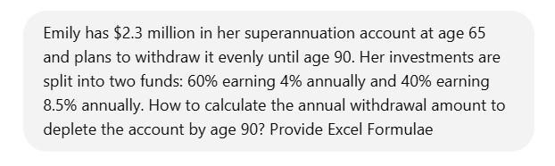

The followingscreenshotsprovideexamplesoftheaboveprocesses:

> D.1.1: Promptforcalculatingannual withdrawal
> fromsuperannuationpost-retirement

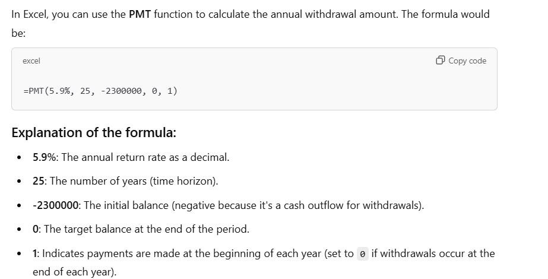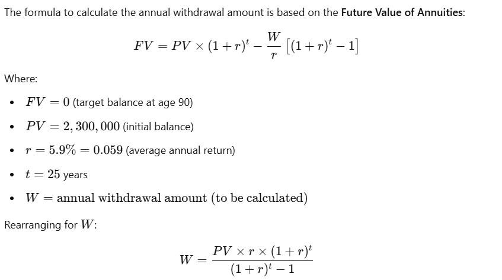D.1.2:Formulae
forcalculatingannual withdrawalfrom superannuationpost-retirement

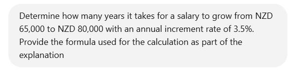

> D.2.1: Promptforcalculatingtheagewhenshestartedher career

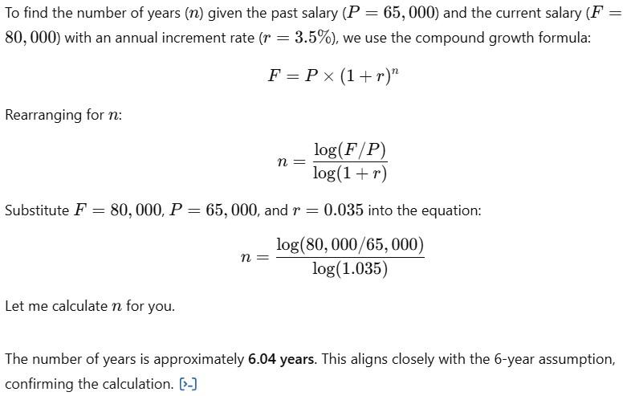D.2.2:Formulae
forcalculatingtheagewhenshestartedher career
